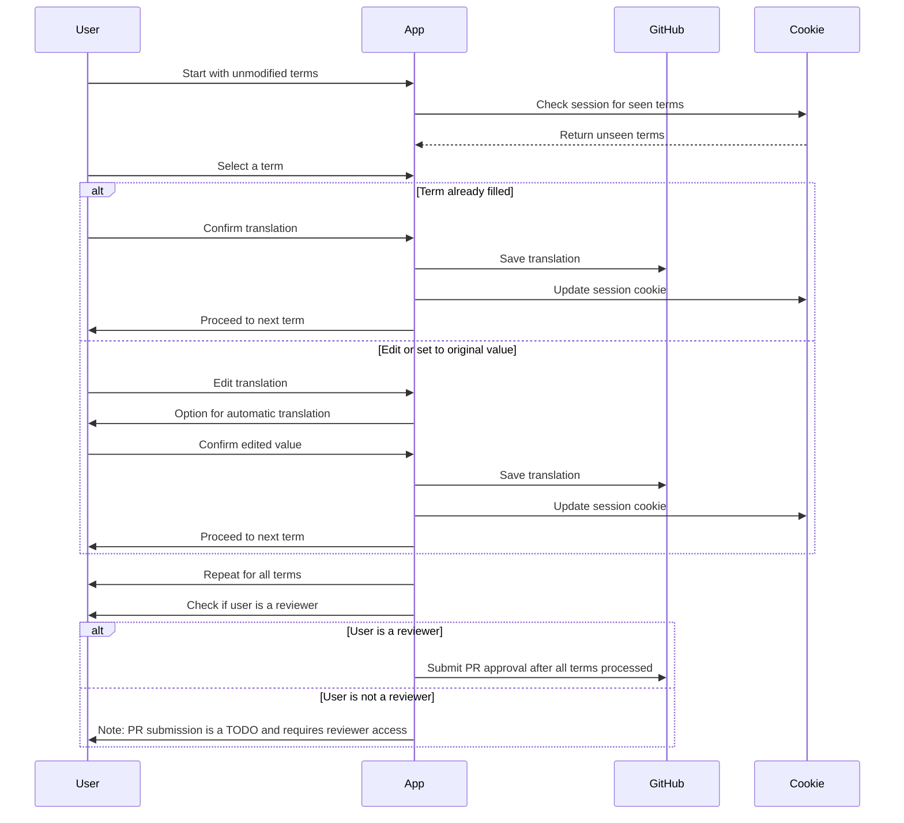

```mermaid
sequenceDiagram
    participant User
    participant App
    participant GitHub
    participant Cookie

    User->>App: Start with unmodified terms
    App->>Cookie: Check session for seen terms
    Cookie-->>App: Return unseen terms
    User->>App: Select a term
    alt Term already filled
        User->>App: Confirm translation
        App->>GitHub: Save translation
        App->>Cookie: Update session cookie
        App->>User: Proceed to next term
    else Edit or set to original value
        User->>App: Edit translation
        App->>User: Option for automatic translation
        User->>App: Confirm edited value
        App->>GitHub: Save translation
        App->>Cookie: Update session cookie
        App->>User: Proceed to next term
    end
    App->>User: Repeat for all terms
    App->>User: Check if user is a reviewer
    alt User is a reviewer
        App->>GitHub: Submit PR approval after all terms processed
    else User is not a reviewer
        App->>User: Note: PR submission is a TODO and requires reviewer access
    end
```
