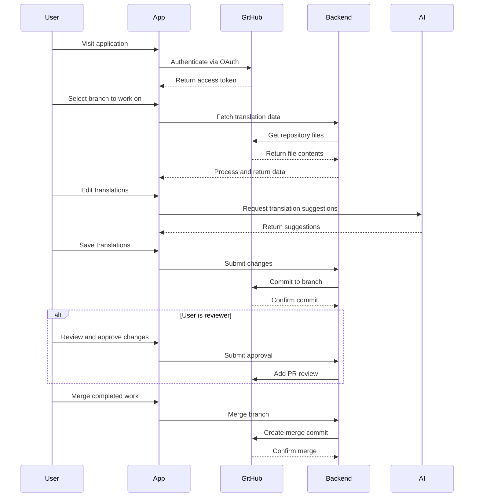

# Marine Term Translations - React Frontend


A collaborative web application for translating marine terminology with GitHub integration, AI-powered suggestions, and comprehensive review workflows.

## 🌊 Overview

The Marine Term Translations React Frontend enables researchers, translators, and marine science professionals to collaboratively translate marine terminology across multiple languages. Built on semantic web technologies and integrated with GitHub for version control, the platform provides a streamlined workflow for managing large-scale translation projects.

### Key Features

- **🔐 GitHub OAuth Authentication** - Secure login with GitHub accounts
- **🌿 Branch-based Workflow** - Work on translations in isolated branches
- **🤖 AI Translation Suggestions** - Get intelligent translation recommendations
- **👥 Review and Approval System** - Collaborative review process for quality assurance
- **📊 Progress Tracking** - Visual charts showing translation completion status
- **🔄 Real-time Conflict Resolution** - Handle merge conflicts with interactive tools
- **🌐 Semantic Data Support** - Process RDF/SKOS data with linked data technologies
- **📱 Responsive Design** - Works seamlessly across desktop and mobile devices

## 🚀 Quick Start

### Prerequisites

- **Node.js** 16.x or higher
- **npm** 8.x or higher
- **GitHub account** for authentication
- **Backend service** (see [API Documentation](docs/API.md))

### Installation

1. **Clone the repository**
   ```bash
   git clone https://github.com/marine-term-translations/React-Front-End.git
   cd React-Front-End
   ```

2. **Install dependencies**
   ```bash
   npm install
   ```

3. **Configure environment**
   ```bash
   cp .env.example .env
   # Edit .env with your configuration
   ```

4. **Start development server**
   ```bash
   npm start
   ```

The application will be available at [http://localhost:3000](http://localhost:3000).

## 📋 User Workflow



## 🏗️ Architecture

The application follows a modern React architecture with clear separation of concerns:

- **Component-Based UI** - Modular, reusable React components
- **Custom Hooks** - Encapsulated state management and business logic
- **Service Layer** - Centralized API interactions
- **Session Storage** - Persistent application state
- **Responsive Design** - Bootstrap-based responsive layouts

### Technology Stack

- **Frontend**: React 18, React Router, React Bootstrap
- **State Management**: React Hooks, Custom Hooks, Session Storage
- **HTTP Client**: Axios
- **Semantic Data**: N3, JSON-LD, Comunica SPARQL
- **Charts**: Chart.js, React Chart.js 2
- **Testing**: Jest, React Testing Library
- **Build**: Create React App, Webpack
- **Deployment**: GitHub Pages

## 📚 Documentation

Comprehensive documentation is available in the `docs/` directory:

| Document | Description |
|----------|-------------|
| **[📁 Project Structure](https://github.com/marine-term-translations/React-Front-End/blob/main/docs/PROJECT_STRUCTURE.md)** | Complete overview of file organization and architecture |
| **[🧩 Components](https://github.com/marine-term-translations/React-Front-End/blob/main/docs/COMPONENTS.md)** | Detailed component documentation with props and examples |
| **[⚙️ Setup Guide](https://github.com/marine-term-translations/React-Front-End/blob/main/docs/SETUP.md)** | Development environment setup and workflow |
| **[🔌 API Services](https://github.com/marine-term-translations/React-Front-End/blob/main/docs/API.md)** | API service documentation and utilities |
| **[🧭 Routing](https://github.com/marine-term-translations/React-Front-End/blob/main/docs/ROUTING.md)** | Navigation and URL structure documentation |
| **[📊 State Management](https://github.com/marine-term-translations/React-Front-End/blob/main/docs/STATE_MANAGEMENT.md)** | State patterns and data flow |
| **[🤝 Contributing](https://github.com/marine-term-translations/React-Front-End/blob/main/docs/CONTRIBUTING.md)** | Guidelines for contributing to the project |
| **[🏛️ Architecture](https://github.com/marine-term-translations/React-Front-End/blob/main/docs/ARCHITECTURE.md)** | System architecture and design patterns |

## 🎯 Core Features

### Translation Workspace
- **Multi-language Support** - Work with multiple target languages simultaneously
- **Contextual Editing** - See original terms alongside translations
- **Auto-save** - Automatic saving of translation progress
- **History Tracking** - Navigate through translation history

### AI-Powered Suggestions
- **Smart Recommendations** - Get context-aware translation suggestions
- **Multiple Providers** - Support for various AI translation services
- **Quality Scoring** - Confidence ratings for suggestions
- **Learning Integration** - Improve suggestions based on user feedback

### Review System
- **File-level Approval** - Approve translations at the file level
- **Label-specific Review** - Granular approval for individual terms
- **Reviewer Dashboard** - Dedicated interface for reviewers
- **Progress Tracking** - Monitor review completion across projects

### Conflict Resolution
- **Visual Diff Viewer** - Side-by-side comparison of conflicts
- **Interactive Resolution** - Point-and-click conflict resolution
- **Batch Operations** - Resolve multiple conflicts efficiently
- **Preview Changes** - See the impact of resolution choices

## 🛠️ Development

### Project Structure

```
src/
├── components/          # Reusable UI components
│   ├── BranchCard.js   # Branch selection cards
│   ├── BranchChart.js  # Progress visualization
│   ├── Changed.js      # Diff viewer and conflicts
│   └── ...
├── pages/              # Route-level components
│   ├── Branches.js     # Branch selection page
│   ├── Translate.js    # Main translation interface
│   └── ...
├── hooks/              # Custom React hooks
│   └── useBranches.js  # Branch data management
├── utils/              # Service functions
│   ├── apiService.js   # GitHub API integration
│   ├── linkedDataUtils.js # RDF/SKOS processing
│   └── ...
└── assets/             # Static assets
```

### Available Scripts

```bash
npm start          # Start development server
npm test           # Run test suite
npm run build      # Create production build
npm run lint       # Run ESLint
npm run deploy     # Deploy to GitHub Pages
```

### Testing

```bash
# Run all tests
npm test

# Run tests with coverage
npm test -- --coverage

# Run specific test file
npm test BranchCard.test.js
```

## 🚀 Deployment

The application is configured for deployment on GitHub Pages with automated CI/CD:

### Manual Deployment
```bash
node deploy.js your-repository-name
```

### Automated Deployment
Push to the main branch triggers automatic deployment via GitHub Actions.

### Environment Configuration
- Development: `.env`
- Production: `.env.production`
- Required variables: `REACT_APP_BACK_URL`, `REACT_APP_REPO`

## 🤝 Contributing

We welcome contributions from the marine science and translation communities! Please see our [Contributing Guidelines](docs/CONTRIBUTING.md) for detailed information on:

- **Development Workflow** - Branch strategy and development process
- **Code Standards** - Coding conventions and quality requirements
- **Testing Requirements** - Test coverage and testing patterns
- **Documentation Standards** - How to document your contributions
- **Pull Request Process** - Review and merge procedures

### Quick Contributing Steps

1. **Fork the repository**
2. **Create a feature branch** (`git checkout -b feature/amazing-feature`)
3. **Make your changes** with tests and documentation
4. **Commit your changes** (`git commit -m 'Add amazing feature'`)
5. **Push to the branch** (`git push origin feature/amazing-feature`)
6. **Open a Pull Request**

## 📄 License

This project is licensed under the MIT License - see the [LICENSE](LICENSE) file for details.

## 🙏 Acknowledgments

- **Marine Science Community** - For providing domain expertise and terminology
- **Translation Contributors** - For their valuable linguistic contributions
- **Open Source Libraries** - For the excellent tools that make this project possible
- **GitHub** - For providing the collaboration platform and hosting

## 📞 Support

- **Issues**: [GitHub Issues](https://github.com/marine-term-translations/React-Front-End/issues)
- **Discussions**: [GitHub Discussions](https://github.com/marine-term-translations/React-Front-End/discussions)
- **Documentation**: [docs/](https://github.com/marine-term-translations/React-Front-End/blob/main/docs/) directory
- **Examples**: See existing components and tests

## 🔗 Related Projects

- **Backend API** - The server-side component handling GitHub integration
- **Translation Memory** - Shared translation resources and terminology databases
- **Marine Ontologies** - Semantic web resources for marine terminology

---

**Built with ❤️ for the marine science community**


