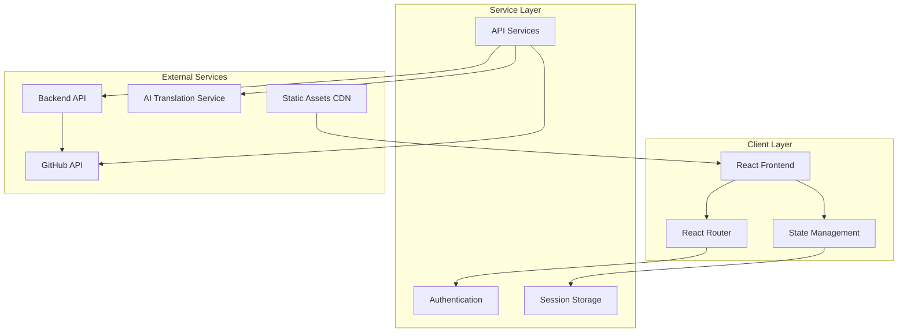
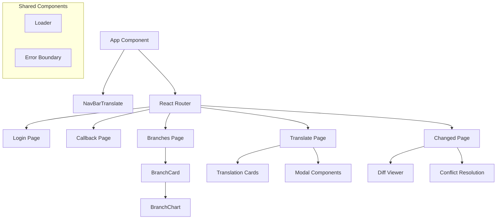
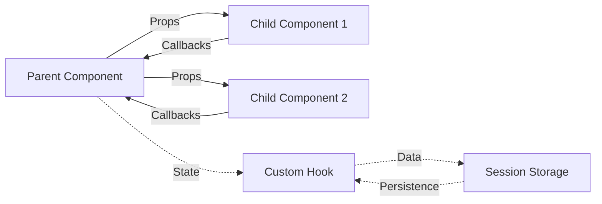
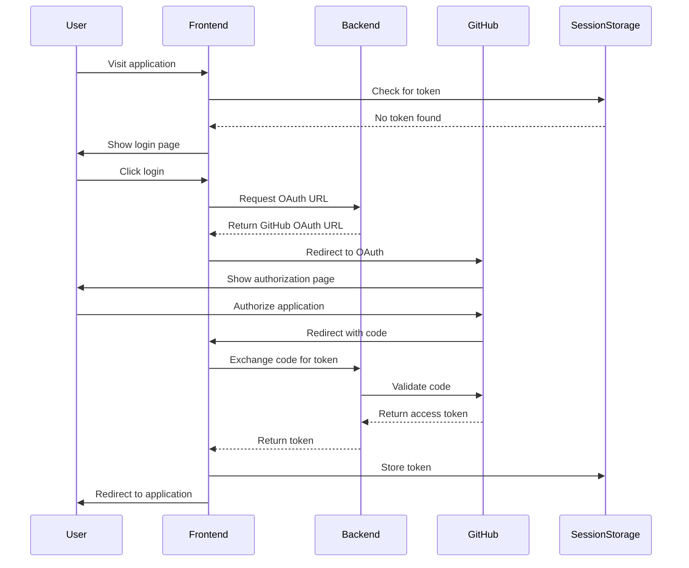
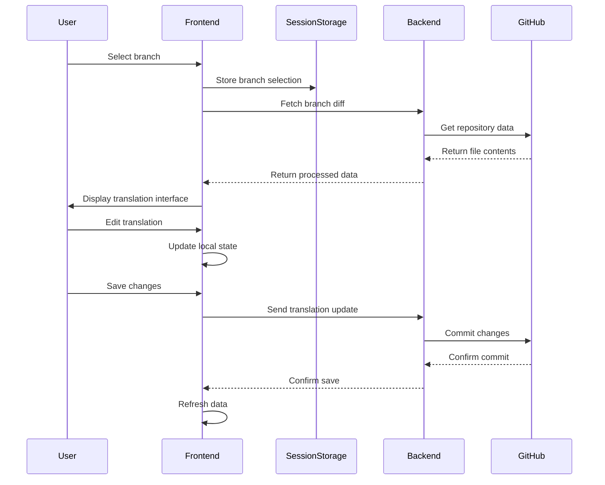
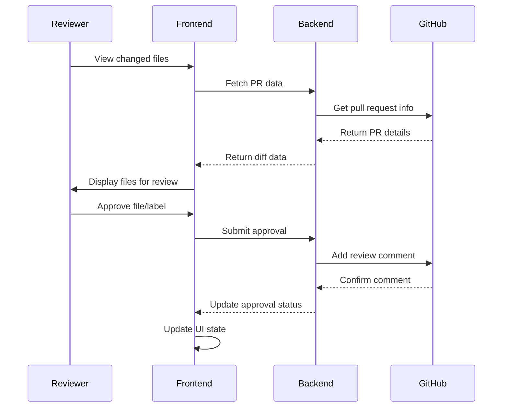

# Architecture Overview

This document provides a comprehensive overview of the system architecture, design patterns, and technical decisions behind the Marine Term Translations React Frontend.

## Table of Contents

- [System Overview](#system-overview)
- [Architecture Patterns](#architecture-patterns)
- [Component Architecture](#component-architecture)
- [Data Flow Architecture](#data-flow-architecture)
- [Integration Architecture](#integration-architecture)
- [Security Architecture](#security-architecture)
- [Performance Considerations](#performance-considerations)
- [Scalability Design](#scalability-design)
- [Technology Stack](#technology-stack)
- [Future Considerations](#future-considerations)

---

## System Overview

The Marine Term Translations React Frontend is a web application designed for collaborative translation of marine terminology. The system enables researchers and translators to work on semantic data translations with version control, review processes, and AI-assisted suggestions.

### High-Level Architecture



### System Boundaries

**Internal System:**
- React frontend application
- Client-side routing and state management
- Local session storage
- Component-based UI architecture

**External Dependencies:**
- Backend API service
- GitHub API for authentication and repository management
- AI translation service
- GitHub Pages for hosting

---

## Architecture Patterns

### 1. Component-Based Architecture

The application follows React's component-based architecture with clear separation of concerns:

```
Application
├── Page Components (Routes)
│   ├── Authentication (Login, Callback)
│   ├── Branch Management (Branches)
│   ├── Translation Workspace (Translate)
│   └── Change Management (Changed)
├── Reusable Components
│   ├── UI Components (Cards, Charts, Modals)
│   ├── Navigation (NavBar)
│   └── Utility Components (Loader, Error)
└── Business Logic
    ├── Custom Hooks (useBranches)
    ├── API Services
    └── Utility Functions
```

### 2. Service Layer Pattern

API interactions are centralized in service modules:

```javascript
// Service layer abstraction
const ApiService = {
  github: {
    fetchBranches,
    fetchBranchDiff,
    sendUpdateFile,
    // ... other GitHub operations
  },
  translation: {
    fetchSuggestions,
    // ... other translation operations
  },
  auth: {
    exchangeToken,
    getCurrentUser,
    // ... other auth operations
  }
};
```

### 3. Custom Hook Pattern

Complex state logic is extracted into reusable custom hooks:

```javascript
// Encapsulates branch data management
const useBranches = () => {
  // State management
  // Data fetching
  // Error handling
  // Return interface
};

// Usage in components
const BranchesPage = () => {
  const { branches, loading, error } = useBranches();
  // Component rendering logic
};
```

### 4. Session Storage Pattern

Critical application state is persisted using session storage:

```javascript
// Centralized session management
const SessionManager = {
  auth: {
    setToken: (token) => sessionStorage.setItem('github_token', token),
    getToken: () => sessionStorage.getItem('github_token'),
    clearToken: () => sessionStorage.removeItem('github_token'),
  },
  branch: {
    setCurrent: (branch) => sessionStorage.setItem('branch', branch),
    getCurrent: () => sessionStorage.getItem('branch'),
  }
};
```

---

## Component Architecture

### Component Hierarchy



### Component Responsibilities

#### Page Components
- **Route-level components** that represent full pages
- **State management** for page-specific data
- **Authentication guards** and route protection
- **Data fetching** and error handling

#### Reusable Components
- **UI rendering** with minimal business logic
- **Prop-based configuration** for flexibility
- **Event handling** through callback props
- **Consistent styling** and behavior

#### Business Logic Components
- **Custom hooks** for state and side effect management
- **Service modules** for API interactions
- **Utility functions** for data processing

### Component Communication



**Communication Patterns:**
- **Props Down**: Data flows from parent to child components
- **Callbacks Up**: Events bubble up through callback functions
- **Shared State**: Session storage for cross-component data
- **Custom Hooks**: Encapsulated state and logic sharing

---

## Data Flow Architecture

### Authentication Flow



### Translation Data Flow



### Review and Approval Flow



---

## Integration Architecture

### GitHub Integration

The application integrates deeply with GitHub for:

**Authentication:**
- OAuth 2.0 flow for user authentication
- Token-based API access
- User permission management

**Repository Management:**
- Branch listing and selection
- File content retrieval
- Diff generation and viewing
- Commit creation and management

**Pull Request Workflow:**
- PR creation and management
- Review and approval tracking
- Comment and discussion handling
- Merge operations

**Architecture Pattern:**
```javascript
// Proxy pattern through backend
Frontend → Backend API → GitHub API
```

This pattern provides:
- **Security**: GitHub tokens not exposed to frontend
- **Rate Limiting**: Centralized API call management
- **Data Processing**: Backend handles complex GitHub API responses
- **Caching**: Backend can cache frequently accessed data

### AI Translation Integration

**Service Architecture:**
```javascript
Frontend → Backend API → AI Translation Service
```

**Integration Features:**
- On-demand translation suggestions
- Language detection and validation
- Error handling and fallback strategies
- Rate limiting and quota management

### Static Asset Integration

**GitHub Pages Deployment:**
- Automated deployment via GitHub Actions
- HashRouter for client-side routing compatibility
- CDN distribution for global performance

---

## Security Architecture

### Authentication Security

**Token Management:**
- JWT tokens stored in session storage (not localStorage)
- Automatic token expiration handling
- Secure token exchange through backend proxy

**Session Security:**
- Session-only storage (cleared on tab close)
- No sensitive data persistence
- Automatic cleanup on logout

### API Security

**Request Security:**
- All API calls authenticated with tokens
- HTTPS enforcement in production
- Rate limiting handled by backend

**Data Validation:**
- Input validation on both client and server
- XSS protection through React's built-in sanitization
- No direct GitHub API access from frontend

### Access Control

**Role-Based Permissions:**
- User role detection (reviewer vs. contributor)
- Feature availability based on permissions
- UI adapts to user capabilities

**Route Protection:**
- Authentication guards on protected routes
- Automatic redirect for unauthorized access
- Branch-level access control

---

## Performance Considerations

### Client-Side Performance

**Bundle Optimization:**
- Tree shaking for unused code elimination
- Code splitting at route level (future enhancement)
- Minification and compression

**Runtime Performance:**
- React.memo for expensive component re-renders
- useCallback and useMemo for optimization
- Efficient state updates and avoiding unnecessary renders

**Network Performance:**
- Axios for optimized HTTP requests
- Request caching where appropriate
- Debounced API calls for user inputs

### Loading Strategies

**Progressive Loading:**
- Skeleton screens for better perceived performance
- Lazy loading for non-critical components
- Background data refresh

**Error Handling:**
- Graceful degradation for API failures
- Retry mechanisms for network issues
- Fallback UI states

### Memory Management

**Component Cleanup:**
- Effect cleanup in useEffect hooks
- Event listener removal
- Subscription cancellation

**State Management:**
- Minimal state in session storage
- Garbage collection friendly patterns
- Avoiding memory leaks in event handlers

---

## Scalability Design

### Component Scalability

**Modular Design:**
- Loosely coupled components
- Clear interfaces through props
- Reusable component library

**State Scalability:**
- Custom hooks for complex state logic
- Centralized session storage management
- Minimal prop drilling

### Feature Scalability

**Extension Points:**
- Plugin-like architecture for new features
- Service layer abstraction for new integrations
- Component composition patterns

**Internationalization Ready:**
- String externalization preparation
- Unicode support for multilingual content
- RTL layout consideration

### Performance Scalability

**Optimization Strategies:**
- Route-based code splitting opportunities
- Component lazy loading potential
- Service worker for offline capabilities (future)

---

## Technology Stack

### Core Technologies

**Frontend Framework:**
- React 18.x (Hooks, Functional Components)
- React Router DOM 6.x (Client-side routing)
- React Bootstrap 2.x (UI components)

**Build and Development:**
- Create React App (Build tooling)
- Webpack (Module bundling)
- Babel (JavaScript transpilation)
- ESLint (Code linting)

**Testing:**
- Jest (Test runner)
- React Testing Library (Component testing)
- User Event (User interaction testing)

### Supporting Libraries

**HTTP and API:**
- Axios (HTTP client)
- Error handling and interceptors

**Data Processing:**
- Chart.js (Data visualization)
- React Chart.js 2 (React integration)
- Date-fns-tz (Date/time handling)

**Semantic Data:**
- N3 (RDF processing)
- JSON-LD (Linked data)
- Comunica (SPARQL queries)

**UI and UX:**
- React Icons (Icon library)
- Bootstrap (CSS framework)
- React Diff Viewer (Code comparison)

### Development Tools

**Code Quality:**
- ESLint with React rules
- Prettier (Code formatting)
- Husky (Git hooks)

**Deployment:**
- GitHub Pages (Static hosting)
- GitHub Actions (CI/CD)
- Custom deployment scripts

---

## Future Considerations

### Planned Enhancements

**Performance Improvements:**
- Route-based code splitting
- Service worker implementation
- Progressive Web App features

**Feature Additions:**
- Real-time collaboration
- Advanced translation memory
- Batch translation operations
- Export functionality

**Technical Improvements:**
- TypeScript migration
- GraphQL integration
- Enhanced testing coverage
- Accessibility improvements

### Architectural Evolution

**State Management:**
- Consider Redux Toolkit for complex state
- Implement React Query for server state
- Add optimistic updates

**Component Architecture:**
- Design system implementation
- Storybook for component documentation
- Micro-frontend architecture evaluation

**Integration Improvements:**
- WebSocket for real-time updates
- Background sync capabilities
- Enhanced offline support

### Scalability Preparations

**Multi-tenancy:**
- Organization-based isolation
- Role and permission system enhancement
- Resource quota management

**Internationalization:**
- Full i18n implementation
- Dynamic language switching
- Cultural adaptation features

**Performance at Scale:**
- Virtual scrolling for large datasets
- Pagination and infinite scroll
- Client-side caching strategies

---

## Conclusion

The Marine Term Translations React Frontend is built on a solid architectural foundation that prioritizes:

- **Maintainability**: Clear separation of concerns and modular design
- **Scalability**: Extensible patterns and loose coupling
- **Performance**: Optimized rendering and efficient data flow
- **Security**: Secure authentication and data handling
- **User Experience**: Responsive design and progressive enhancement

The architecture supports the current requirements while providing flexibility for future enhancements. The component-based design, service layer abstraction, and session-based state management create a robust foundation for collaborative translation workflows.

This architecture documentation serves as a guide for developers working on the project and helps ensure architectural consistency as the system evolves.