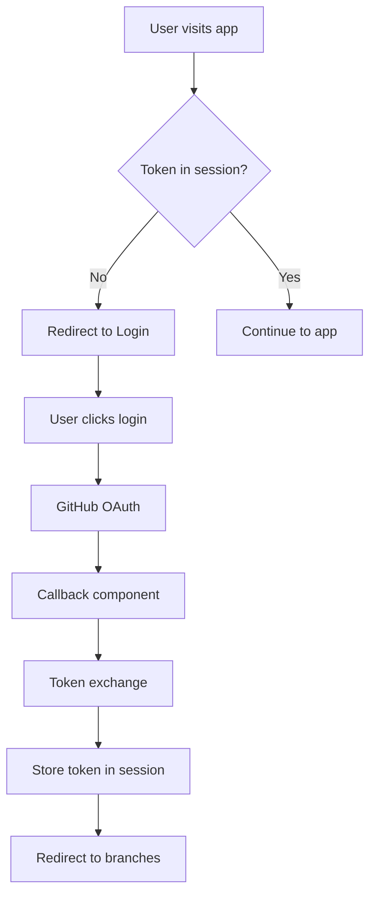
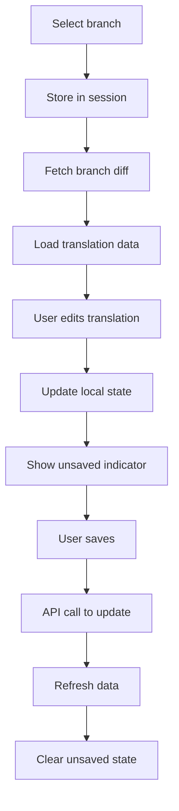
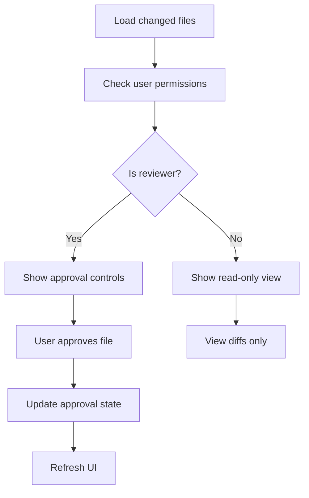

# State Management Documentation

This document provides comprehensive documentation for state management patterns, data flow, and state persistence used throughout the application.

## Table of Contents

- [Overview](#overview)
- [State Management Patterns](#state-management-patterns)
- [Component State](#component-state)
- [Global State](#global-state)
- [Session Storage](#session-storage)
- [Data Flow](#data-flow)
- [State Persistence](#state-persistence)
- [Custom Hooks](#custom-hooks)
- [State Synchronization](#state-synchronization)
- [Best Practices](#best-practices)

---

## Overview

The application uses a combination of React's built-in state management capabilities and browser storage for state persistence. The architecture follows these principles:

- **Local Component State**: Using `useState` for component-specific data
- **Custom Hooks**: Centralizing state logic for reusability
- **Session Storage**: Persisting critical application state
- **Prop Drilling**: Minimal, with custom hooks reducing the need
- **No External State Library**: Redux/Zustand not needed due to app complexity

---

## State Management Patterns

### 1. Local Component State

Most components manage their own state using React's `useState` hook:

```javascript
const Component = () => {
  const [loading, setLoading] = useState(false);
  const [error, setError] = useState(null);
  const [data, setData] = useState([]);
  
  // Component logic
};
```

### 2. Custom Hooks for Shared Logic

Complex state logic is extracted into custom hooks:

```javascript
// useBranches.js
const useBranches = () => {
  const [branches, setBranches] = useState([]);
  const [loading, setLoading] = useState(true);
  const [error, setError] = useState(null);
  
  // Fetch and manage branch data
  
  return { branches, loading, error };
};
```

### 3. Session Storage for Persistence

Critical application state is persisted in session storage:

```javascript
// Authentication state
sessionStorage.setItem('github_token', token);
sessionStorage.getItem('github_token');

// Current branch
sessionStorage.setItem('branch', branchName);
sessionStorage.getItem('branch');
```

---

## Component State

### Authentication Components

#### Login Component State
```javascript
const Login = () => {
  const [gitHubLink, setGitHubLink] = useState(null);     // OAuth URL
  const [error, setError] = useState(null);               // Error messages
  const [loading, setLoading] = useState(true);           // Loading state
  
  // OAuth link generation and error handling
};
```

#### Callback Component State
```javascript
const Callback = () => {
  const [error, setError] = useState(null);               // OAuth errors
  const [loading, setLoading] = useState(true);           // Processing state
  
  // Token exchange and redirect logic
};
```

### Main Application Components

#### Branches Component State
Uses the `useBranches` custom hook:
```javascript
const Branches = () => {
  const { error, loading, branches, emptyField, totalFieldsCount } = useBranches();
  
  // No local state - everything managed by custom hook
};
```

#### Translate Component State
**Core Application State:**
```javascript
const Translate = () => {
  // Data state
  const [contents, setContents] = useState([]);           // Translation data
  const [selectedLanguage, setSelectedLanguage] = useState('en'); // Current language
  const [translations, setTranslations] = useState({});   // Modified translations
  const [suggestions, setSuggestions] = useState({});     // AI suggestions
  
  // UI state
  const [error, setError] = useState(null);               // Error messages
  const [loading, setLoading] = useState(true);           // Loading states
  const [modalShow, setModalShow] = useState(false);      // Modal visibility
  const [showToast, setShowToast] = useState(false);      // Toast notifications
  
  // Review state
  const [reviewerMode, setReviewerMode] = useState(false); // Current user mode
  const [isReviewer, setIsReviewer] = useState(false);    // Reviewer permissions
  const [prNumber, setPrNumber] = useState(null);         // PR number
  const [approvalDetails, setApprovalDetails] = useState({}); // Approval status
  
  // Complex state management logic
};
```

#### Changed Component State
**Diff and Conflict Management:**
```javascript
const Changed = () => {
  // Core data
  const [diffs, setDiffs] = useState([]);                 // File differences
  const [comments, setComments] = useState([]);           // PR comments
  const [conflicts, setConflicts] = useState([]);         // Merge conflicts
  
  // UI state
  const [modal, setModal] = useState(null);               // Modal content
  const [error, setError] = useState(null);               // Error messages
  const [loading, setLoading] = useState(true);           // Loading state
  const [modalShow, setModalShow] = useState(false);      // Modal visibility
  
  // Conflict resolution
  const [overwrite, setOverwrite] = useState({});         // Resolution choices
  const [upToDate, setUpToDate] = useState(false);        // Branch status
  
  // Statistics
  const [emptyField, setEmptyField] = useState({});       // Empty field counts
  const [emptyFieldFile, setEmptyFieldFile] = useState({}); // File counts
  
  // Review system
  const [prNumber, setPrNumber] = useState(null);         // PR number
  const [allValuesApproved, setAllValuesApproved] = useState(false); // Approval status
  const [currentUser, setCurrentUser] = useState(null);   // User data
  const [reviewers, setReviewers] = useState([]);         // Reviewers list
};
```

---

## Global State

### Authentication State

Authentication is managed globally through session storage:

```javascript
// Setting authentication
const setAuthToken = (token) => {
  sessionStorage.setItem('github_token', token);
};

// Getting authentication
const getAuthToken = () => {
  return sessionStorage.getItem('github_token');
};

// Checking authentication
const isAuthenticated = () => {
  return !!sessionStorage.getItem('github_token');
};

// Clearing authentication
const clearAuth = () => {
  sessionStorage.removeItem('github_token');
  sessionStorage.removeItem('branch');
};
```

### Branch State

Current branch is managed globally:

```javascript
// Setting current branch
const setCurrentBranch = (branchName) => {
  sessionStorage.setItem('branch', branchName);
};

// Getting current branch
const getCurrentBranch = () => {
  return sessionStorage.getItem('branch');
};

// Branch-dependent navigation
const requiresBranch = () => {
  const branch = getCurrentBranch();
  if (!branch) {
    navigate('/branches');
    return false;
  }
  return true;
};
```

---

## Session Storage

### Storage Keys and Usage

| Key | Type | Purpose | Persistence |
|-----|------|---------|-------------|
| `github_token` | string | Authentication token | Session only |
| `branch` | string | Current selected branch | Session only |
| `cardHistory` | JSON array | Navigation history | Session only |

### Storage Utilities

```javascript
// Generic storage utilities
const SessionStorage = {
  set: (key, value) => {
    try {
      sessionStorage.setItem(key, JSON.stringify(value));
    } catch (error) {
      console.error('Failed to save to session storage:', error);
    }
  },
  
  get: (key, defaultValue = null) => {
    try {
      const item = sessionStorage.getItem(key);
      return item ? JSON.parse(item) : defaultValue;
    } catch (error) {
      console.error('Failed to read from session storage:', error);
      return defaultValue;
    }
  },
  
  remove: (key) => {
    sessionStorage.removeItem(key);
  },
  
  clear: () => {
    sessionStorage.clear();
  }
};
```

### History Management

Navigation history is persisted for better UX:

```javascript
// In Translate component
const [cardHistory, setCardHistory] = useState([]);

// Load history on mount
useEffect(() => {
  try {
    const history = JSON.parse(sessionStorage.getItem('cardHistory') || '[]');
    setCardHistory(history);
  } catch {
    setCardHistory([]);
  }
}, []);

// Save history on changes
useEffect(() => {
  sessionStorage.setItem('cardHistory', JSON.stringify(cardHistory));
}, [cardHistory]);
```

---

## Data Flow

### Authentication Flow



### Translation Data Flow



### Review and Approval Flow



---

## State Persistence

### Session-Based Persistence

All critical state is persisted in session storage:

```javascript
// Authentication persistence
useEffect(() => {
  const token = sessionStorage.getItem('github_token');
  if (!token) {
    navigate('/');
  }
}, []);

// Branch persistence
useEffect(() => {
  const branch = sessionStorage.getItem('branch');
  if (branch) {
    setCurrentBranch(branch);
  }
}, []);
```

### Data Synchronization

Components synchronize with session storage:

```javascript
// NavBar component
const [isBranch, setIsBranch] = useState(false);

useEffect(() => {
  const branchExists = sessionStorage.getItem('branch');
  if (branchExists) {
    setIsBranch(true);
  }
}, []);
```

### State Restoration

After page refresh, state is restored from session storage:

```javascript
// Translate component initialization
useEffect(() => {
  const initializeComponent = () => {
    // Restore authentication
    const token = sessionStorage.getItem('github_token');
    if (!token) {
      navigate('/');
      return;
    }
    
    // Restore branch
    const branch = sessionStorage.getItem('branch');
    if (!branch) {
      navigate('/branches');
      return;
    }
    
    // Restore history
    const history = JSON.parse(sessionStorage.getItem('cardHistory') || '[]');
    setCardHistory(history);
    
    // Continue with component initialization
    fetchData();
  };
  
  initializeComponent();
}, []);
```

---

## Custom Hooks

### useBranches Hook

**Location**: `src/hooks/useBranches.js`

Manages branch data and statistics:

```javascript
const useBranches = () => {
  const [error, setError] = useState(null);
  const [loading, setLoading] = useState(true);
  const [branches, setBranches] = useState([]);
  const [emptyField, setEmptyField] = useState({});
  const [totalFieldsCount, setTotalFieldsCount] = useState({});
  const navigate = useNavigate();

  useEffect(() => {
    const fetchBranchesData = async () => {
      // Authentication check
      const token = sessionStorage.getItem("github_token");
      if (!token) {
        setError("Authorization token is missing...");
        setTimeout(() => navigate("/"), 3000);
        return;
      }

      try {
        // Fetch and process branch data
        const branchesData = await fetchBranches(token);
        setBranches(branchesData);
        
        // Calculate statistics for each branch
        const totalFieldsCount = {};
        const translationCounts = {};
        
        // Process each branch asynchronously
        branchesData.forEach(async (branchData) => {
          const branch = branchData.name;
          const contents = await fetchBranchDiff(token, branch);
          
          // Calculate statistics
          // ... statistics calculation logic
          
          // Update state
          setEmptyField(prev => ({
            ...prev,
            [branch]: translationCounts[branch]
          }));
          setTotalFieldsCount(prev => ({
            ...prev,
            [branch]: totalFieldsCount[branch]
          }));
        });

        setLoading(false);
        setError(null);
      } catch (error) {
        setError(errorMessage);
        setLoading(false);
      }
    };

    fetchBranchesData();
  }, [navigate]);

  return { error, loading, branches, emptyField, totalFieldsCount };
};
```

**State Management Features:**
- Automatic authentication validation
- Async data fetching with error handling
- Statistical calculation for translation progress
- Automatic cleanup on errors

---

## State Synchronization

### Cross-Component Communication

Components communicate through session storage and props:

```javascript
// BranchCard sets branch and navigates
<Card href={`?branch=${branch.name}#/translate`}>

// Translate component reads branch from URL/session
const params = new URLSearchParams(window.location.search);
const branch = params.get('branch');
sessionStorage.setItem('branch', branch);

// NavBar component reads branch from session
const branchExists = sessionStorage.getItem('branch');
```

### Real-Time Updates

Some components update in real-time:

```javascript
// Translate component tracks unsaved changes
const calculateModifiedCounts = () => {
  let modifiedFields = 0;
  // ... calculation logic
  return { modifiedFields };
};

// Warning on page unload if changes exist
useEffect(() => {
  const handleBeforeUnload = (event) => {
    if (calculateModifiedCounts().modifiedFields > 0) {
      event.preventDefault();
      event.returnValue = "";
    }
  };

  window.addEventListener("beforeunload", handleBeforeUnload);
  return () => {
    window.removeEventListener("beforeunload", handleBeforeUnload);
  };
}, []);
```

---

## Best Practices

### State Organization

1. **Group Related State**
   ```javascript
   // Good: Group related UI state
   const [ui, setUi] = useState({
     loading: false,
     error: null,
     modal: false
   });
   
   // Better: Use separate state for independent concerns
   const [loading, setLoading] = useState(false);
   const [error, setError] = useState(null);
   const [modal, setModal] = useState(false);
   ```

2. **Use Custom Hooks for Complex Logic**
   ```javascript
   // Extract complex state logic
   const useTranslationData = (branch) => {
     const [data, setData] = useState([]);
     const [loading, setLoading] = useState(true);
     
     // Complex data fetching and processing
     
     return { data, loading, refresh: () => fetchData() };
   };
   ```

3. **Minimize Session Storage Usage**
   ```javascript
   // Only store essential state
   const essentialState = {
     token: user.token,
     branch: current.branch,
     // Don't store entire API responses
   };
   ```

### Error Handling in State

1. **Consistent Error State Structure**
   ```javascript
   const [error, setError] = useState(null);
   
   // Consistent error format
   const handleError = (error) => {
     setError({
       message: error.message,
       type: 'api_error',
       timestamp: Date.now()
     });
   };
   ```

2. **Error Recovery**
   ```javascript
   const retryOperation = () => {
     setError(null);
     setLoading(true);
     performOperation();
   };
   ```

### Performance Optimization

1. **Memoize Expensive Calculations**
   ```javascript
   const expensiveValue = useMemo(() => {
     return calculateStatistics(largeDataSet);
   }, [largeDataSet]);
   ```

2. **Debounce Frequent Updates**
   ```javascript
   const debouncedSave = useCallback(
     debounce((data) => saveToApi(data), 500),
     []
   );
   ```

3. **Cleanup Effects**
   ```javascript
   useEffect(() => {
     const subscription = subscribeToUpdates();
     
     return () => {
       subscription.unsubscribe();
     };
   }, []);
   ```

This state management documentation provides a comprehensive guide to understanding how data flows through the application and how state is managed across components. The patterns shown here prioritize simplicity and maintainability while providing the functionality needed for the translation workflow.